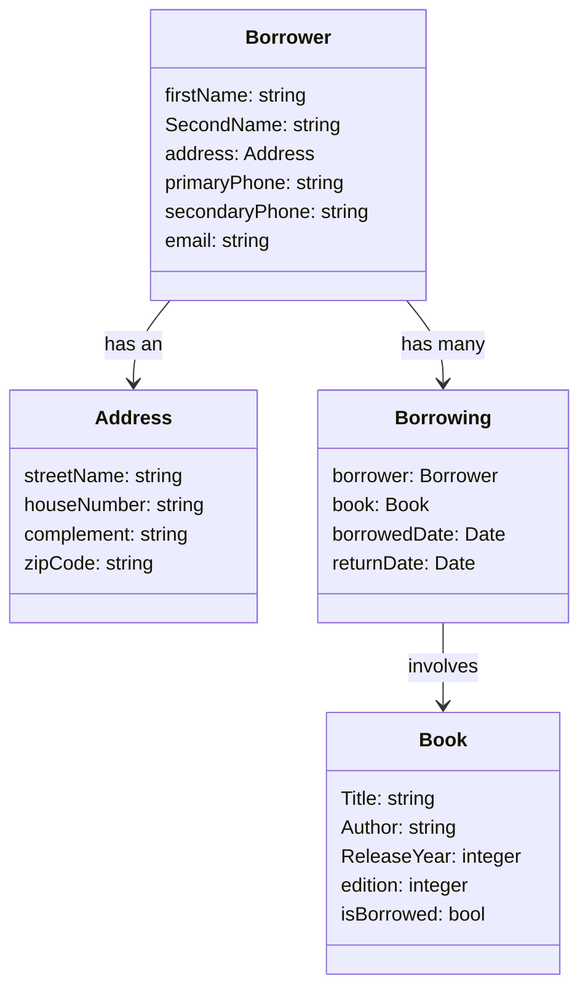

# Library API

## API Description

This API is designed for managing a library system, allowing for comprehensive management of users, books, and their borrowing activities. The API supports adding, deleting, updating, and retrieving users and books.
Additionally, it enables tracking and managing borrowing events, including retrieving the borrowing history for each user.

## Features
- User Management: Add, delete, update, and retrieve user information.
- Book Management: Add, delete, update, and retrieve book information.
- Borrow Management: Track and manage book borrowings, including:
  - Borrowing a book
  - Returning a book
  - Checking which books are currently borrowed
- Borrowing History: Browse through the borrowing history of each user to see past borrowing activities.

---

